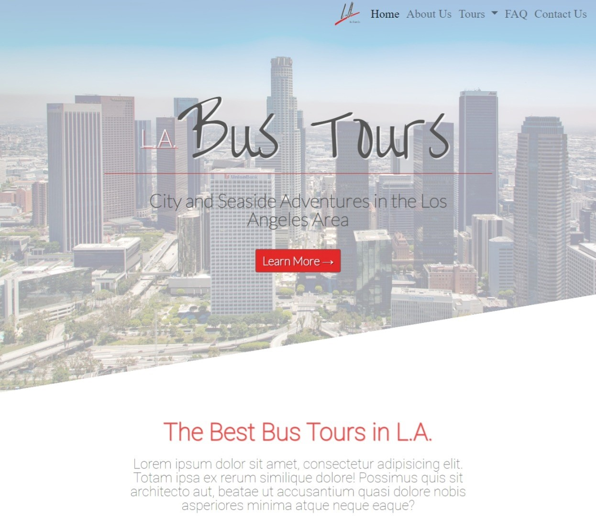
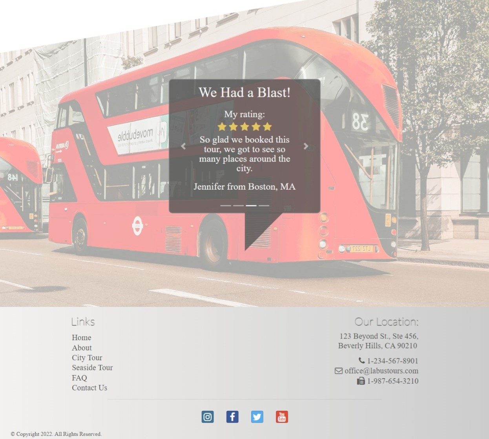
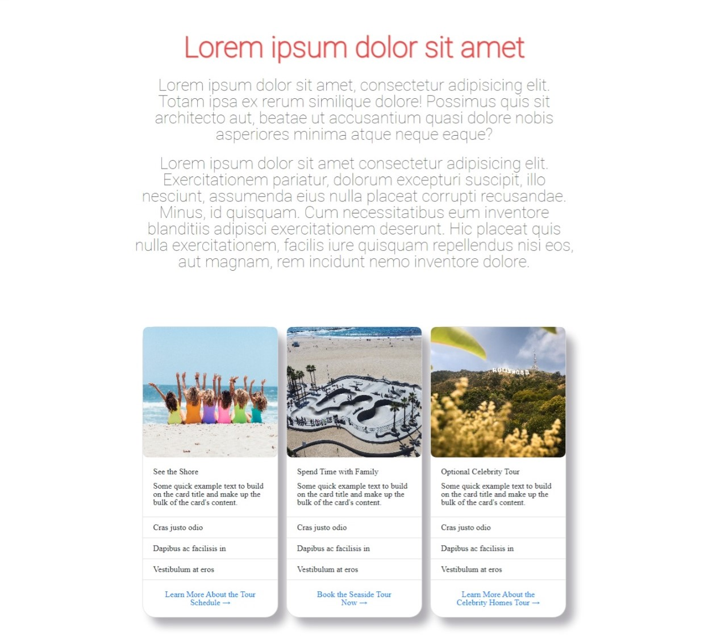
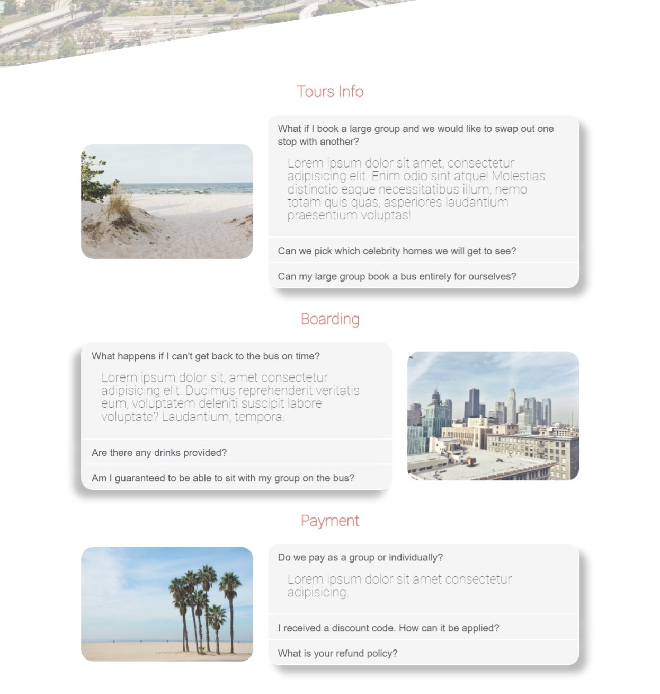
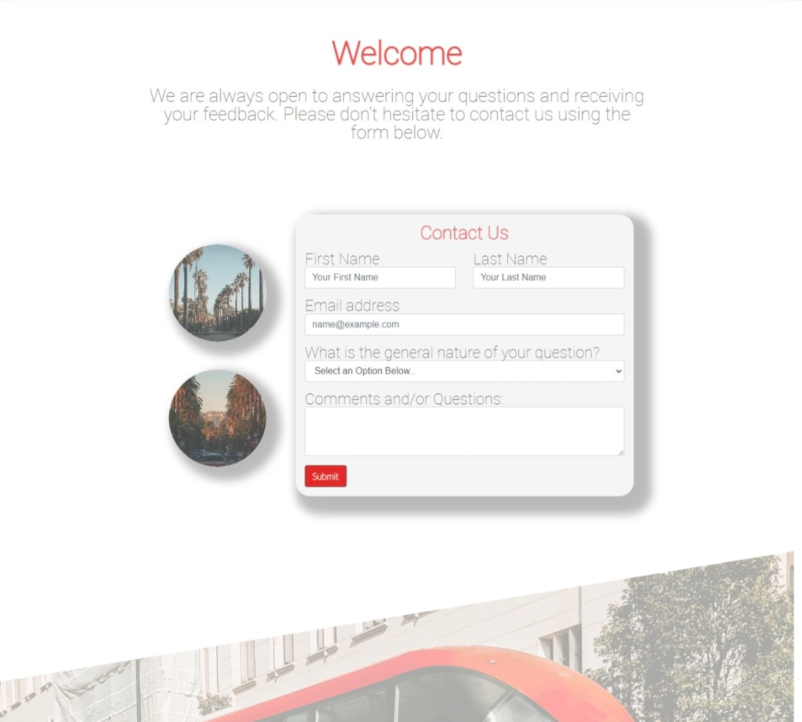

## L.A. Bus Tours Co.

An HTML-based website for a bus tour company. Built with Bootstrap, SASS, and jQuery.

## Project Screen Shots 

Home Page Jumbotron

The home page displays a jumbotron with introductory information.

Home Page Review Carousel

There's a review carousel that automatically switches slides. Alternatively, it can manually be changed by clicking on the arrows to the left or right of the review.

Bus Tour Detail Cards

The two tour pages display bootstrapped cards outlining some of the trip details.

F.A.Q Accordions

Bootstrap accordions are used to display frequently asked questions.

Contact Form

The Contact page displays a form for visitors to send a message.

## Installation and Setup Instructions

Clone this repository. You will need `npm` installed on your machine.  

Installation:

`npm install`   

To Start Server:

`npm start`  

To Visit App (assuming you have no other application running on port 3000):

`localhost:3000/`  

## Reflection 

This project was built primarily while I was studying in the Nucamp Full Stack Web and Mobile Application Development Bootcamp, during the Bootstrap course. The project goals included using Bootstrap, SASS, and CSS in order to familiarize myself with these technologies. 

While implementing this project I ran into several challenges. To make the project more visually appealing a variety of CSS techniques were implemented, including the use of clip-path, hover effects, animations, and different layout styles. Many of these effects were made with the assistance of tutorials from w3schools.com. 

## References:

- Advanced CSS and Sass: Flexbox, Grid, Animations and More! by Jonas Schmedtmann - https://www.udemy.com/course/advanced-css-and-sass/ (Natours project - For the clip-path in the jumbotron and inspiration for the UI design.)
- w3schools.com (For some of the CSS styling.)

## Photo References:

- https://pixabay.com/photos/beverly-hills-tourism-travel-2260423/
- https://pixabay.com/photos/los-angeles-usa-america-city-498285/
- https://pixabay.com/photos/los-angeles-california-skyline-1598747/
- https://pixabay.com/photos/los-angeles-california-city-urban-1768743/
- https://pixabay.com/photos/los-angeles-santa-monica-beach-sand-2714521/
- https://www.pexels.com/photo/back-view-photo-of-six-girls-wearing-swimsuit-sitting-on-white-sand-2647973/
- https://www.pexels.com/photo/white-and-black-sign-under-blue-sky-5918209/
- https://pixabay.com/photos/california-santa-monica-beach-ocean-4601314/
- https://www.pexels.com/photo/white-sand-beach-5202451/
- https://www.pexels.com/photo/an-aerial-view-of-a-skatepark-on-a-beach-9544778/
- https://www.pexels.com/photo/hollywood-sign-2626916/
- https://www.pexels.com/photo/cars-parked-on-the-side-of-the-road-3166785/ 
- https://www.pexels.com/photo/hollywood-sign-2671089/ 
- https://www.pexels.com/photo/city-art-street-building-8183689/
- https://www.pexels.com/photo/cityscape-during-golden-hour-2545122/
- https://www.pexels.com/photo/photography-of-city-building-1049302/
- https://www.pexels.com/photo/red-double-decker-bus-passing-by-a-street-in-the-city-3459765/
- https://www.pexels.com/photo/black-vehicle-beside-palm-tres-2263669/